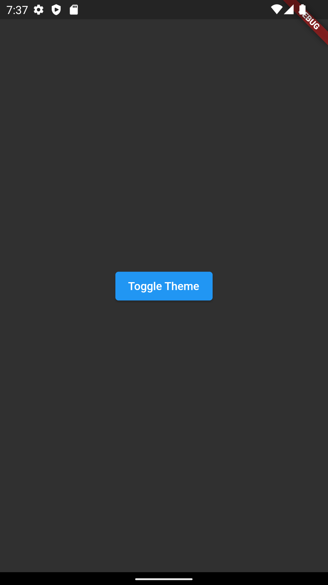

# flutter_fanfq_theme

```
import 'package:flutter/material.dart';

void main() {
  runApp( MyApp());
}

class MyApp extends StatelessWidget {
  final ValueNotifier<ThemeMode> _notifier = ValueNotifier(ThemeMode.light);

  @override
  Widget build(BuildContext context) {
    return ValueListenableBuilder<ThemeMode>(
      valueListenable: _notifier,
      builder: (_, mode, __) {
        return MaterialApp(
          theme: ThemeData.light(),
          darkTheme: ThemeData.dark(),
          themeMode: mode, // Decides which theme to show, light or dark.
          home: Scaffold(
            body: Center(
              child: ElevatedButton(
                onPressed: () => _notifier.value = mode == ThemeMode.light ? ThemeMode.dark : ThemeMode.light,
                child: Text('Toggle Theme'),
              ),
            ),
          ),
        );
      },
    );
  }
}
```

## Getting Started

